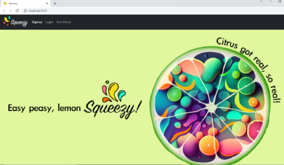
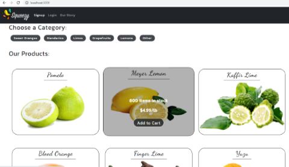
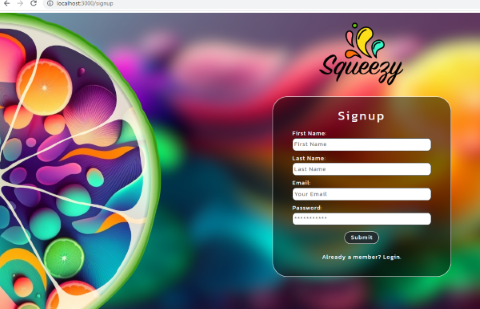
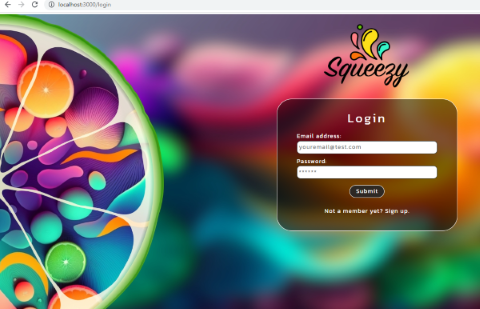

# Easy Peasy, Lemon Squeezy!

Bootcamp buddies would like to present Squeezy, a website where you can order your citrus to stave of scurvy. Built and designed to be a submission for our Michigan State University Bootcamp's Final Project. We have built a working webstore, for a fictional company - Squeezy. Based on a full stack MERN collaboration to showcase the class knowledge we have gained.


## Badges
[](https://choosealicense.com/licenses/mit/)

## Screenshots
 <br>
 <br>

## Installation
**1. Clone to ***your computer*** using SSH from GitHub:**
```
git clone git@github.com:Bootcamp-Buddies/Squeezy.git
```
**2. You'll need to run to install the node required dependencies after you clone the install by running:**
```
npm install
```
**3. Next, you will need to seed the database using the command:**
```
npm run seed
```
**4. Test all functionality by running the application in development mode:**
```
npm run develop
```
**5. Finally run the command to build the production output files and move those to your webhost to run the static pages, alternatively load these to a full host site like Heroku:**
```
npm run build
```
    
## Lessons Learned
Design and 


## Acknowledgements
 - [concurrently](https://www.npmjs.com/package/concurrently)
 - [nodemon](https://www.npmjs.com/package/nodemon)
 - [dotenv](https://www.npmjs.com/package/dotenv)
 - [graphql](https://www.npmjs.com/package/graphql)
 - [mongoose](https://www.npmjs.com/package/mongoose)
 - [express](https://www.npmjs.com/package/express)
 - [apollo-server-express](https://www.npmjs.com/package/apollo-server-express)
 - [@apollo/client](https://www.npmjs.com/package/@apollo/client)
 - [stripe](https://www.npmjs.com/package/stripe)
 - [@stripe/stripe-js](https://www.npmjs.com/package/@stripe/stripe-js)
 - [jsonwebtoken](https://www.npmjs.com/package/jsonwebtoken)
 - [jwt-decode](https://www.npmjs.com/package/jwt-decode)
 - [react](https://www.npmjs.com/package/react)
 - [react-dom](https://www.npmjs.com/package/react-dom)
 - [react-router-dom](https://www.npmjs.com/package/react-router-dom)
 - [react-scripts](https://www.npmjs.com/package/react-scripts)
 - [react-redux](https://www.npmjs.com/package/react-redux)
 - [@reduxjs/toolkit](https://www.npmjs.com/package/@reduxjs/toolkit)
 - [react-bootstrap](https://www.npmjs.com/package/react-bootstrap)
 - [bootstrap](https://www.npmjs.com/package/bootstrap)
 - [Readme.co](https://readme.so/editor)

## Authors
- [yeezyhub](https://github.com/yeezyhub)
- [thafer1](https://github.com/thafer1)
- [sgsetts](https://github.com/sgsetts)
- [jscobie](https://github.com/jscobie)


